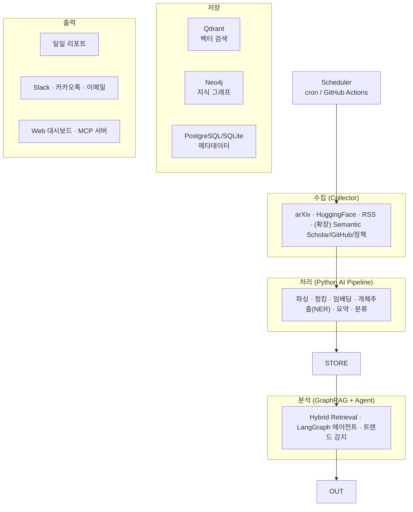

# AIRP — AI Research Intelligence Platform 프로젝트 개요

> 이 문서는 흩어져 있던 기획·아키텍처·로드맵·소스 문서를 **하나로 통합한 기준 문서**입니다.
> 세부 실행 문서는 [Stage 1 MVP 스펙](Stage1%20MVP%20-%20Crawl%20and%20Notify.md), [데이터 모델(ERD)](ERD.md),
> [카카오톡 연동 플로우](%EC%B9%B4%EC%B9%B4%EC%98%A4%ED%86%A1%20%EC%97%B0%EB%8F%99%20%ED%94%8C%EB%A1%9C%EC%9A%B0.md)를 참고하세요.

---

## 1. 프로젝트 개요

**한 줄 정의**
AI 연구 동향(논문·모델·블로그·정책)을 자동 수집하고, 지식 그래프와 GraphRAG로 분석·요약해 **매일 리서치 브리핑**을 만들어 주는 플랫폼.

**목표**
- 매일 아침 핵심 AI 연구·뉴스를 **주제별로 정리**해 Slack·카카오톡·이메일로 발송
- 나아가 **과거 검색(벡터)** 과 **관계 질의(그래프)** 로 "이 모델을 만든 랩의 다른 논문" 같은 인텔리전스 제공
- 최종적으로 **AI Research OS** 수준(40~60개 소스, 자율 리서치 에이전트)까지 확장

**핵심 원칙: 단계적 구축**
거대한 한 방이 아니라 각 단계가 그 자체로 가치 있게 동작하도록 쪼갠다. (→ 5장 로드맵)

---

## 2. 아키텍처

**컴포넌트 역할**
| 계층 | 역할 | 기술 |
|---|---|---|
| 수집 | 대량·안정 크롤링(RSS/API/HTML) | Python(현재) → Rust(확장 시) |
| 처리 | 파싱·청킹·임베딩·개체추출·요약·분류 | Python, LLM, 임베딩 모델 |
| 저장 | 유사도(벡터)/관계(그래프)/사실(관계형) | Qdrant · Neo4j · PostgreSQL |
| 분석 | 하이브리드 검색 + 추론 + 에이전트 | GraphRAG · LangGraph |
| 출력 | 리포트·알림·대시보드·MCP | Slack/Kakao/Email · Next.js |

> 서비스 간 결합도를 낮추기 위해 확장 단계에서는 **이벤트 기반**(Kafka/NATS)으로 파이프라인을 구성한다.

---

## 3. 데이터 소스

수집 대상은 우선순위(Tier)로 관리한다. 크롤링 리스크가 있는 소스(예: X)는 제외하고 **공식 API/RSS**를 우선한다.

| Tier | 주기 | 소스 |
|---|---|---|
| **0 (매일)** | Daily | arXiv(cs.AI/CL/LG/IR), HuggingFace Daily Papers, Semantic Scholar, Papers with Code, OpenReview, GitHub Trending, DeepSeek, Qwen, OpenAI, Anthropic |
| **1 (주간)** | Weekly | NeurIPS·ICML·ICLR·CVPR·MLSys(학회), NVIDIA·Meta·Microsoft·Google Research |
| **2 (월간/정책)** | Monthly | Federal Register, EU AI Act, NIST, 특허(Google Patents/USPTO), 투자 뉴스 |
| 뉴스/큐레이션 | 상시 | MIT Tech Review, The Batch, The Decoder, Import AI, 국내(AI타임스·블로터 등) |

지식 그래프는 단순 문서가 아니라 **Paper · Model · Lab · Benchmark · Researcher · Dataset · Patent · Policy · Repository** 관계를 추적한다.

---

## 4. 기술 스택 (확정)

| 영역 | 선택 | 비고 |
|---|---|---|
| 수집 언어 | Python 3.13 (현재) / Rust (확장) | MVP는 Python, 스케일 시 Rust 이관 |
| 패키지 | uv | 빠르고 재현 가능 |
| 메시지 큐 | (확장) NATS JetStream → Kafka | Stage 1엔 불필요 |
| 벡터 DB | **Qdrant** | 임베딩 검색 |
| 그래프 DB | **Neo4j** | 관계 질의 |
| 관계형 DB | SQLite(현재) → PostgreSQL | 메타데이터·중복제거 |
| 임베딩 | **BGE-M3 (1024차원)** | 벡터 차원과 컬렉션 설정 일치 필수 |
| 요약·분류 LLM | Gemini / OpenAI / Anthropic 중 1개 | 현재 `gemini-flash-lite-latest` |
| 에이전트 | LangGraph | GraphRAG 오케스트레이션 |
| API / UI | FastAPI + Next.js | Stage 4 |
| 알림 | Slack · 카카오톡 · 이메일(SMTP) | Stage 1 구현 완료 |
| 인프라 | Docker → Kubernetes/Helm | Stage 5 |
| CI/CD | GitHub Actions (ruff + pytest) | 구현 완료 |

---

## 5. 개발 로드맵 (단계별)

거대한 스펙을 5단계로 재구성. 각 단계는 독립적으로 가치가 있다.

| 단계 | 이름 | 핵심 가치 | 추가되는 것 | 상태 |
|---|---|---|---|---|
| **1** | **Crawl & Notify** | 매일 AI 소식이 알림으로 온다 | 수집·필터·분류·요약·알림·아카이브 | ✅ **구현 완료** |
| 2 | Knowledge | 모은 걸 검색·질의한다 | 임베딩·Qdrant·Neo4j·GraphRAG·검색 API | ⬜ 예정 |
| 3 | Intelligence | 트렌드·심층 분석 | LangGraph 에이전트·트렌드 감지 | ⬜ 예정 |
| 4 | Application | 웹에서 본다 | Next.js 대시보드·MCP 서버 | ⬜ 예정 |
| 5 | Enterprise | 다중 사용자·운영 | K8s·인증(SSO/RBAC)·멀티테넌트·모니터링 | ⬜ 예정 |

**Stage 2로 넘어가는 신호**: "지난주 나온 MoE 논문 찾아줘"(과거 검색), "이 모델 만든 랩의 다른 논문"(관계 질의)이 필요해질 때.

Stage 1 상세는 [Stage 1 MVP 스펙](Stage1%20MVP%20-%20Crawl%20and%20Notify.md), 데이터 모델은 [ERD](ERD.md) 참고.

---

## 6. 개발 원칙

1. 코드보다 **아키텍처를 먼저** 설계
2. 모든 서비스는 **독립 배포** 가능하게
3. **도메인 중심(DDD)** 모델링
4. **비동기·이벤트 기반** 파이프라인
5. **테스트 우선**(현재 pytest + ruff CI)
6. **관측 가능성**(로그·메트릭·트레이싱) 기본 내장
7. **보안·운영**을 초기부터 고려

---

## 부록: 문서 맵

| 문서 | 내용 |
|---|---|
| **AIRP 프로젝트 개요** (이 문서) | 비전·아키텍처·소스·스택·로드맵 통합 |
| [Stage 1 MVP 스펙](Stage1%20MVP%20-%20Crawl%20and%20Notify.md) | 현재 구현 단계의 상세 스펙 |
| [데이터 모델(ERD)](ERD.md) | 현재/제안 스키마 |
| [카카오톡 연동 플로우](%EC%B9%B4%EC%B9%B4%EC%98%A4%ED%86%A1%20%EC%97%B0%EB%8F%99%20%ED%94%8C%EB%A1%9C%EC%9A%B0.md) | 알림 채널 연동 절차 |
