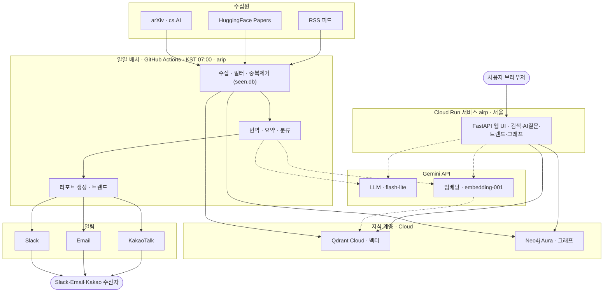
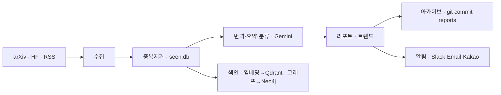
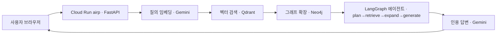

# AIRP — 아키텍처 & 데이터 흐름

AIRP(AI 연구 인텔리전스 플랫폼)는 매일 논문·기사를 수집해 지식 그래프에 색인하고 브리핑으로 알리는 **배치(쓰기)** 경로와, 브라우저에서 그 지식을 검색·질의하는 **서빙(읽기)** 경로가 하나의 클라우드 지식 계층을 공유하는 구조다.

| 지표 | 값 |
|---|---|
| 수집 소스 | 3 (arXiv · HuggingFace · RSS) |
| 그래프 색인 문서 | 94 |
| 벡터 검색 recall@1 | 100% |
| Gemini 임베딩 차원 | 3072-d |

---

## FIG.1 — 시스템 아키텍처

구성요소와 연결 (실선 = 데이터 이동, 점선 = Gemini 호출).

---

## FIG.2 — 데이터 흐름 ① 쓰기 경로 (BATCH)

매일 07:00(KST) GitHub Actions가 `arip`를 실행.

1. **수집** — arXiv(cs.AI), HuggingFace Papers, RSS 피드에서 항목을 모은다. 한 소스가 실패해도 나머지는 진행.
2. **중복제거** — `seen.db`(SQLite)로 이미 처리한 항목을 걸러 신규만 남긴다. Actions 캐시로 실행 간 유지.
3. **가공** — Gemini로 제목 한국어 번역 · 초록 요약 · 카탈로그 분류.
4. **색인** — 신규 항목을 임베딩해 Qdrant에 upsert, 문서·저자·카테고리 관계를 Neo4j에 적재(멱등).
5. **리포트·트렌드** — 그래프에서 카테고리 급상승을 계산해 리포트 상단에 삽입.
6. **아카이브·알림** — `reports/*.md`를 저장소에 커밋(공개 웹 아카이브) 후 Slack·Email·KakaoTalk로 발송.

---

## FIG.3 — 데이터 흐름 ② 읽기 경로 (SERVE · GraphRAG)

브라우저에서 Cloud Run 서비스 `airp`로 질의.

1. **질의 임베딩** — 사용자 질문을 Gemini로 같은 벡터 공간에 임베딩.
2. **벡터 검색** — Qdrant에서 코사인 유사 상위 문서를 검색.
3. **그래프 확장** — Neo4j에서 상위 문서의 관련 문서·저자·카테고리 이웃을 확장(GraphRAG).
4. **에이전트 추론** — LangGraph가 질문을 하위질의로 분해 → 다중 검색 → 그래프 확장 → 인용 포함 한국어 답변 생성.
5. **응답** — 검색 결과·관련문서·그래프·AI 답변을 웹 UI에 반환.

---

## 구성요소

| 레이어 | 구성요소 | 역할 |
|---|---|---|
| 수집원 | arXiv · HuggingFace · RSS | 연구 논문·기사 원천 |
| 배치 | GitHub Actions · `arip` | 수집→가공→색인→아카이브→알림 (쓰기) |
| LLM | Gemini API | 번역·요약·분류·질의응답 + 임베딩 |
| 지식계층 | Qdrant Cloud · Neo4j Aura | 벡터 검색 + 지식 그래프 (공유 저장소) |
| 알림 | Slack · Email · KakaoTalk | 일일 브리핑 발송 |
| 서빙 | Cloud Run · `airp` (FastAPI) | 검색·AI질문·트렌드·그래프 웹 UI (읽기) |

## 기술 스택

`Python 3.11` · `uv` · `FastAPI` · `uvicorn` · `LangGraph` · `Qdrant Cloud` · `Neo4j Aura` · `Gemini flash-lite` · `gemini-embedding-001` · `Docker` · `Cloud Run (Seoul)` · `Cloud Build` · `GitHub Actions`

---

- 서비스: https://airp-105639816783.asia-northeast3.run.app
- 저장소: `LumenSemantics/on-demand-rag`
- 역할 분리: **GitHub Actions**가 매일 지식계층에 *쓰고*, **Cloud Run** 웹 UI가 실시간으로 *읽는다*.
