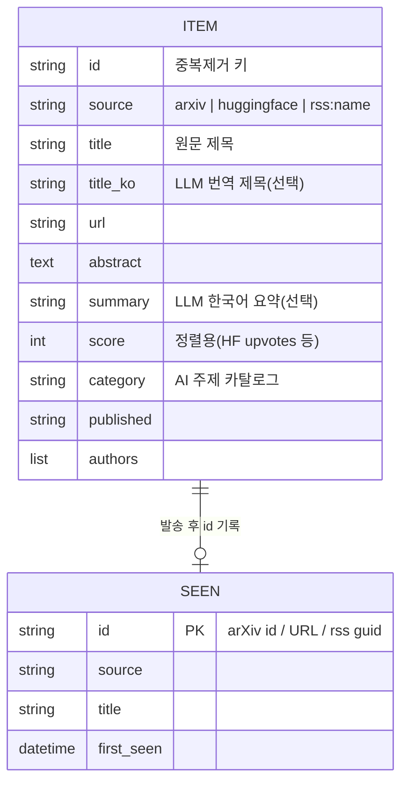
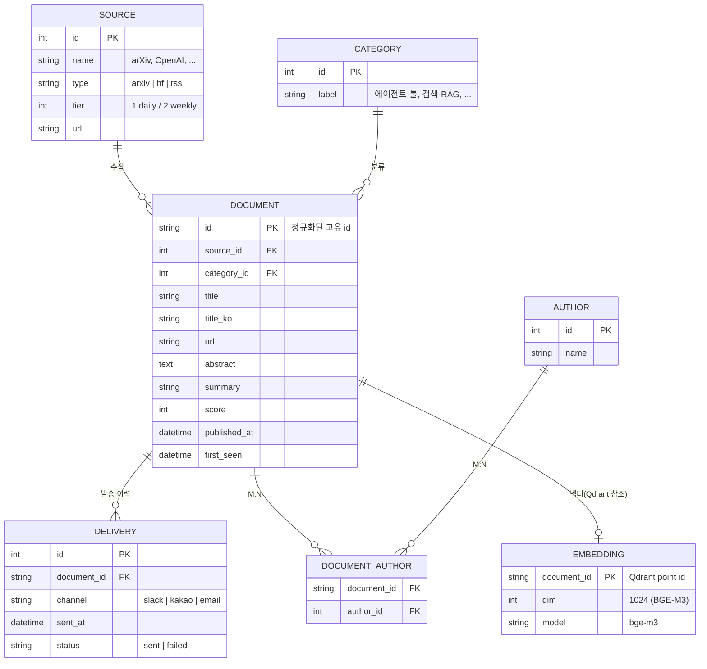
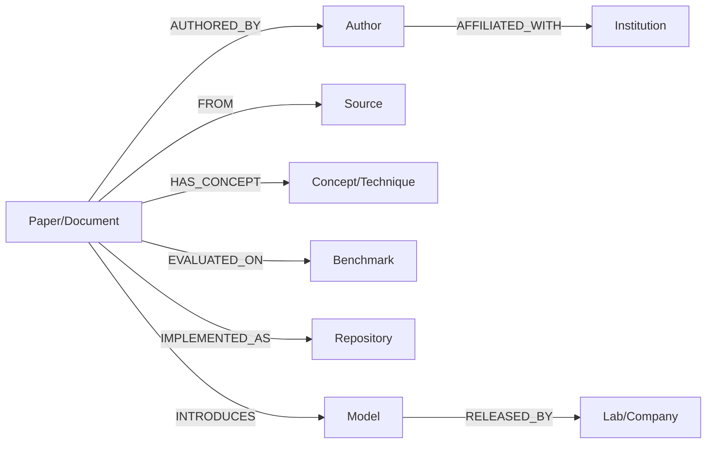

# ARIP 데이터 모델 (ERD)

프로젝트의 엔터티 관계도입니다. **현재 구현(Stage 1)** 과 **Stage 2 제안 스키마**를 나눠 표기합니다.
(GitHub에서 열면 아래 Mermaid 다이어그램이 그림으로 렌더링됩니다.)

---

## 1. 현재 구현 (Stage 1)

Stage 1은 "수집 → 알림"만 하므로 **영속 저장은 SQLite `seen` 테이블 하나**뿐입니다.
`Item`은 매 실행 시 메모리에서만 존재하는 도메인 객체(DTO)이며 DB에 저장되지 않습니다.

- **SEEN** — 유일한 영속 테이블. 이미 발송한 항목의 `id`를 기록해 재알림을 막음.
- **ITEM** — 수집·필터·분류·요약·번역을 거치는 인메모리 객체. 발송 후 `id`만 SEEN에 남김.
- 리포트는 DB가 아니라 파일(`reports/YYYY-MM-DD.md`)로 아카이브됨.

---

## 2. Stage 2 제안 스키마 (관계형 메타 스토어)

과거 검색·관계 질의가 필요해지는 Stage 2에서는 `Item`을 정규화해 영속화합니다.
이 관계형 스토어가 **Qdrant(벡터)·Neo4j(그래프)의 기준(source of truth)** 역할을 합니다.

### 엔터티 설명
| 엔터티 | 역할 |
|---|---|
| **SOURCE** | 수집 소스(arXiv·HF·RSS 등)와 우선순위 |
| **DOCUMENT** | 영속화된 항목(현 `Item`) — 검색/발송의 중심 |
| **CATEGORY** | AI 주제 카탈로그 분류 |
| **AUTHOR** / **DOCUMENT_AUTHOR** | 저자, 문서-저자 다대다 |
| **DELIVERY** | 채널별 발송 이력(현 `seen`을 확장·대체) |
| **EMBEDDING** | 문서 벡터 메타(실제 벡터는 Qdrant에 저장, `document_id`로 연결) |

---

## 3. 지식 그래프 (Neo4j) — 참고

Neo4j는 관계형이 아니라 **그래프**라 ERD와 별개입니다. DOCUMENT를 중심으로 온톨로지 노드를 연결합니다.

> 관계형(DOCUMENT/AUTHOR/SOURCE/CATEGORY)은 사실을 저장하고,
> 그래프(Neo4j)는 그 사실들 사이의 **관계 탐색**을, 벡터(Qdrant)는 **유사도 검색**을 담당합니다.

---

## 요약
- **지금**: `seen` 테이블 1개 + 인메모리 `Item`. (알림만 하므로 이걸로 충분)
- **Stage 2**: `DOCUMENT` 중심 정규화 스키마 → Qdrant(벡터)·Neo4j(그래프)의 기준 데이터.
- 확장은 "과거 검색/관계 질의가 필요해질 때" 이 스키마부터 도입.
