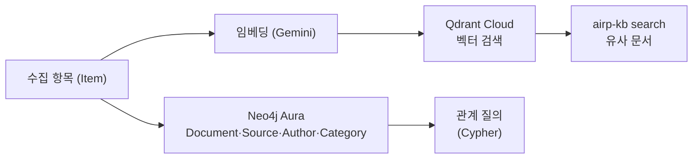

# Stage 2 — Knowledge (Qdrant + Neo4j 클라우드)

> 목표: 수집한 항목을 **저장하고 검색·질의**할 수 있게 한다.
> Qdrant Cloud(벡터 유사도) + Neo4j Aura(관계 질의) **무료 티어**로 진행한다.
> 임베딩은 이미 쓰는 **Gemini 키를 재사용**(gemini-embedding-001, 3072차원)한다.

---

## 1. 아키텍처



- **Qdrant** — 문서 임베딩 저장, "비슷한 논문 찾기"
- **Neo4j** — 문서-소스-저자-카테고리 그래프, "이 랩의 다른 논문" 같은 관계 질의
- 실제 벡터는 Qdrant에, 관계는 Neo4j에. 둘 다 `Item.id`로 연결.

---

## 2. 클라우드 계정 만들기 (무료)

> 계정 생성·비밀번호는 직접 하셔야 합니다. 발급받은 값만 `.env`에 넣으면 됩니다.

### ① Qdrant Cloud
1. [cloud.qdrant.io](https://cloud.qdrant.io) 가입(신용카드 불필요)
2. **Create Cluster → Free** → 리전 선택 → 생성
3. 값 2개 복사:
   - **Cluster URL**: `https://xxxx.cloud.qdrant.io:6333` → `QDRANT_URL`
   - **API Key**: (Data Access / API Keys에서 발급) → `QDRANT_API_KEY`

### ② Neo4j AuraDB (Aura Free)
1. [console.neo4j.io](https://console.neo4j.io) 가입 → **New Instance → AuraDB Free**
2. 생성 시 **비밀번호가 한 번만 표시** → 반드시 저장(credentials 파일 다운로드)
3. 값:
   - **Connection URI**: `neo4j+s://xxxx.databases.neo4j.io` → `NEO4J_URI`
   - **User**: `neo4j` → `NEO4J_USER`
   - **Password**: (생성 시 표시) → `NEO4J_PASSWORD`

> 무료 한도(대략 Qdrant 1GB / Aura 노드 20만·관계 40만)는 가입 화면에서 확인.
> Aura Free는 며칠 미사용 시 자동 일시정지 → 매일 크론이 돌면 깨어남.

---

## 3. `.env` 설정

```
# Qdrant Cloud
QDRANT_URL=https://xxxx.cloud.qdrant.io:6333
QDRANT_API_KEY=발급받은_키

# Neo4j Aura
NEO4J_URI=neo4j+s://xxxx.databases.neo4j.io
NEO4J_USER=neo4j
NEO4J_PASSWORD=생성시_비밀번호

# 임베딩 (Gemini 키 재사용 — LLM_API_KEY 그대로 사용)
EMBED_PROVIDER=gemini
EMBED_MODEL=gemini-embedding-001
```

자동 실행(GitHub Actions)에도 쓰려면 같은 값들을 **Secrets**에 추가.

---

## 4. 설치 & 연결 점검

```bash
uv sync --extra knowledge   # qdrant-client, neo4j 설치
uv run airp-kb check        # 임베딩·Qdrant·Neo4j 연결 각각 점검
```
`[embed] OK / [qdrant] OK / [neo4j] OK` 가 모두 뜨면 준비 완료.

---

## 5. 사용

```bash
# 오늘 수집분을 벡터+그래프에 색인 (테스트는 --limit로 소량)
uv run airp-kb index --limit 30

# 벡터 유사도 검색
uv run airp-kb search "효율적인 MoE 대형 언어모델"

# GraphRAG: 벡터 검색 + 그래프 관련 문서(카테고리·저자 공유)
uv run airp-kb related "에이전트 강화학습"
```

### 자동 색인 (데일리 브리핑)
`airp` 실행 시 신규 항목이 **자동으로 Qdrant/Neo4j에 색인**됩니다(설정돼 있을 때만). 끄려면 `--no-index`.

### GraphRAG 웹 UI
```bash
uv sync --extra api
uv run airp-api        # → http://127.0.0.1:8000 (검색창 + 관련 문서 시각화)
```

### GitHub Actions 자동 색인
매일 크론에서도 색인하려면 **Secrets**에 `QDRANT_URL`, `QDRANT_API_KEY`, `NEO4J_URI`, `NEO4J_USER`, `NEO4J_PASSWORD` 추가.
(워크플로는 `uv sync --extra knowledge`로 설치하고, 시크릿이 없으면 색인을 건너뜁니다.)

---

## 6. Neo4j 온톨로지 (현재 슬라이스)

```cypher
(:Document {id, title, title_ko, url, summary, published})
(:Source {name})
(:Category {label})
(:Author {name})

(Document)-[:FROM]->(Source)
(Document)-[:HAS_CATEGORY]->(Category)
(Author)-[:AUTHORED]->(Document)
```

관계 질의 예:
```cypher
// 같은 소스의 다른 문서
MATCH (d:Document)-[:FROM]->(s:Source)<-[:FROM]-(other)
WHERE d.id = $id RETURN other.title LIMIT 10
```

Stage 3에서 Model·Benchmark·Lab·Concept 노드로 온톨로지를 확장한다. (→ [ERD](ERD.md))

---

## 참고: 개발 환경(venv) 이슈

이 프로젝트가 **OneDrive 폴더 안**에 있으면, OneDrive가 `.venv`를 동기화하며 파일을 잠가 `uv sync`가 간헐적으로 실패할 수 있습니다. 해결책:
- (권장) 프로젝트를 OneDrive 밖으로 이동 (예: `C:\dev\on-demand-rag`)
- 또는 venv를 밖에 두기: 환경변수 `UV_PROJECT_ENVIRONMENT=C:\Users\<계정>\AppData\Local\airp-venv` 설정 후 `uv sync`
- 또는 설치 중 OneDrive 동기화 일시정지
