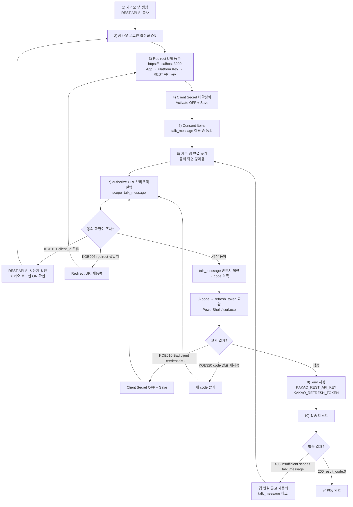

# 카카오톡 "나에게 보내기" 연동 플로우

ARIP 브리핑을 카카오톡으로 발송하기 위한 전체 설정 과정입니다.
각 단계에서 **오류가 나면 해결 후 돌아갈 위치**를 화살표로 표시했습니다.
(GitHub에서 아래 다이어그램이 그림으로 렌더링됩니다.)

---

## 전체 플로우차트

---

## 단계별 요약

| # | 단계 | 위치 |
|---|---|---|
| 1 | 앱 생성 + REST API 키 복사 | developers.kakao.com → 내 애플리케이션 → App → Platform Key |
| 2 | 카카오 로그인 활성화 | Product Settings → Kakao Login → General → State ON |
| 3 | Redirect URI 등록 | App → Platform Key → **REST API key** → Redirect URI `https://localhost:3000` |
| 4 | **Client Secret 비활성화** | App → Platform Key → REST API key → Client Secret → Activate **OFF** → **Save** |
| 5 | talk_message 동의항목 | Kakao Login → Consent Items → "카카오톡 메시지 전송" → 이용 중 동의 |
| 6 | 기존 앱 연결 끊기 | accounts.kakao.com → 연결된 서비스 관리 → 앱 → 연결 끊기 |
| 7 | 인가 코드 받기 | authorize URL을 **브라우저**에서 실행 → 동의 → 주소창 `code=` 값 |
| 8 | 토큰 교환 | **PowerShell**에서 `Invoke-RestMethod` (또는 `curl.exe`) |
| 9 | `.env` 저장 | `KAKAO_REST_API_KEY`, `KAKAO_REFRESH_TOKEN`, `REPORT_BASE_URL` |
| 10 | 발송 테스트 | `200 {"result_code":0}` 이면 성공 |

---

## 오류 → 해결 → 돌아갈 단계

| 오류 | 언제 | 원인 | 해결 | 돌아갈 단계 |
|---|---|---|---|---|
| **KOE101** | authorize | REST 키 아님(JS/Native 키), 옛 키 재발급, 카카오 로그인 OFF | REST API 키 확인 + 카카오 로그인 ON | → 2 |
| **KOE006** | authorize | Redirect URI 미등록/불일치 | `https://localhost:3000` 정확히 등록 | → 3 |
| **KOE010** | 토큰 교환 | **Client Secret이 켜져 있음** (기본 ON) | Activate OFF + **Save** (reissue 아님!) | → 7 (새 code 필요) |
| **KOE320** | 토큰 교환 | 인가 code 만료(10분)·재사용(1회용) | 새 code 발급 | → 7 |
| **403 insufficient scopes** | 발송 | 동의 때 talk_message 권한 미부여 (allowed_scopes 빈 값) | 앱 연결 끊고 재동의(체크!) | → 6 |
| `& 문자 오류` | PowerShell | authorize URL을 터미널에 붙여넣음 | URL은 **브라우저**에서 실행 | → 7 |
| `-d 매개변수 오류` | PowerShell | `curl`이 Invoke-WebRequest 별칭 | `curl.exe` 또는 `Invoke-RestMethod` 사용 | → 8 |

---

## 핵심 교훈 (가장 자주 막힌 3가지)

1. **Client Secret은 기본으로 켜져 있다** → 반드시 **OFF + Save** (안 하면 토큰 교환에서 KOE010). `reissue`는 끄는 게 아니라 새로 발급하는 것.
2. **키 3곳을 통일** → authorize URL의 `client_id`, 토큰 교환의 `client_id`, `.env`의 `KAKAO_REST_API_KEY`가 **모두 같은 REST API 키**여야 함. 키를 재발급하면 옛 키는 KOE101.
3. **동의 화면에서 talk_message를 실제로 체크** → 앱이 이미 연결돼 있으면 동의가 건너뛰어져 권한이 빈 채로 발급됨(403). 연결 끊고 다시 동의.

---

## 실행/역할 정리

| 무엇 | 어디서 |
|---|---|
| authorize URL (code 받기) | **웹 브라우저** |
| 토큰 교환 (`Invoke-RestMethod`) | **PowerShell** |
| refresh_token | 약 60일 유효, 매일 실행되면 자동 갱신 |
| 발송 대상 | 내 카카오톡 **"나와의 채팅"** (나에게 보내기) |
